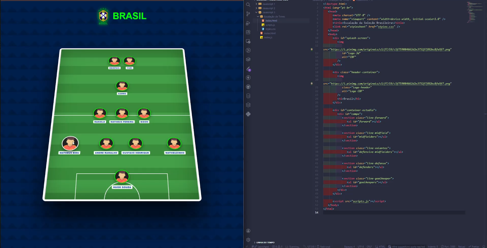

# 🇧🇷 Tactical Board 3D - Seleção Brasileira

Este projeto é uma aplicação interativa desenvolvida para o meu portfólio pessoal, simulando os quadros táticos de alta fidelidade utilizados em transmissões esportivas como as da **TNT Sports** e do **GE**. Ele permite a escalação dinâmica de jogadores em um campo com perspectiva 3D realista.

## 🚀 Tecnologias e Conceitos Aplicados

- **CSS Grid & Flexbox (Híbrido)**: Utilizei uma estrutura de 5 linhas táticas (Goleiro, Defesa, Volante, Meia e Ataque) com um sistema de colunas que trava laterais e pontas nas extremidades, enquanto centraliza zagueiros e meias lado a lado.
- **Transformações 3D**: Aplicação de `perspective` no container e `rotateX` no campo para simular profundidade de estádio.
- **Manipulação de DOM**: O JavaScript gerencia a entrada de dados via `prompt` e cria elementos em tempo real, atribuindo classes dinâmicas para o posicionamento correto.
- **Design Visual Avançado**:
- Gramado realista com listras horizontais e linhas de cal (grande área e círculo central) feitas inteiramente com CSS.
- Efeito de "Giro de Moeda" (360° flip) nos cards dos jogadores com preservação de perspectiva 3D.
- Splash Screen animada com a logo da CBF em rotação.

## 📋 Como o Código foi Estruturado

### JavaScript

A função principal `schedulePlayer` processa a posição informada e decide, através de condicionais, em qual seção do campo o jogador deve ser inserido (ex: `listId = "defenders"`). Também remove espaços para criar classes CSS válidas (ex: "Lateral Direito" vira `.lateral-direito`).

### CSS (A Alma do Projeto)

- **`flex-direction: column-reverse`**: Usado no campo para que o Goleiro (primeiro no HTML) apareça na base visual, facilitando a manutenção do código.
- **`position: absolute`**: Aplicado especificamente aos laterais e pontas para garantir que fiquem fixos nas bordas da mesma linha onde estão os zagueiros e atacantes.
- **Cards de 65px**: Tamanho otimizado para permitir que até 4 ou 5 jogadores ocupem a mesma linha sem quebra de layout.

---

## 🛠️ Próximos Passos

Como parte dos meus estudos em **Estrutura de Dados e Algoritmos com JavaScript**, pretendo implementar:

- Persistência de escalação via `localStorage`.
- Opção de escolher diferentes formações táticas (4-4-2, 4-3-3, 3-5-2).

---

**Desenvolvido por Matheus**
_Estudante de Análise e Desenvolvimento de Sistemas (Formação em 2027)_
